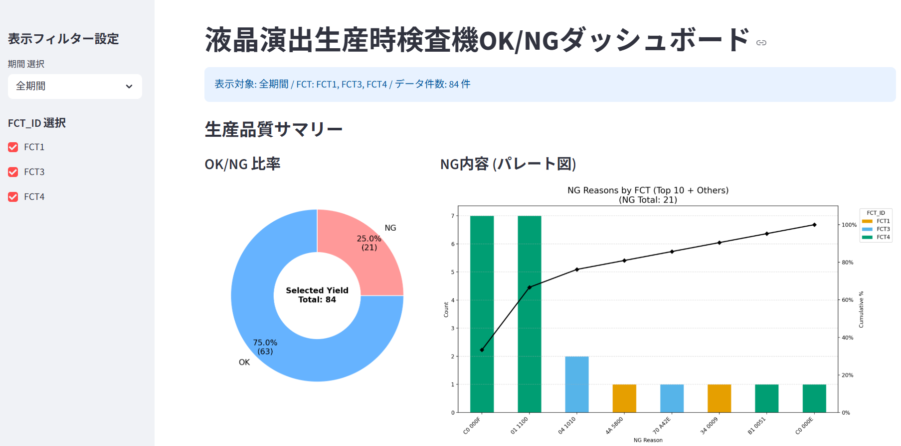

## QRコードの無い（AG5）の場合のダッシュボードプロト版作成しました
20251219

image.png

### 表示内容は下記
- 総合OK/NG比率とトータル生産数の円グラフ
- NG内容のパレート図（FCT毎の積み上げ）
- 日別 不良数・不良率推移
- 機種：Model 毎のOK/NG比率の円グラフ
- FCT毎のOK/NG比率の円グラフ
を表示し、

左のサイドバーでピボット切り替え表示
- 期間：全期間/月間
- FCTの表示選択ラジオボタン
### 使用CSVデータは
　添付　**Trace_log_FCT4.csv**　の形式参照

一応AG６（QRコードあり）でも適用可能　なようにしています。

CSVデータはFCT1～5を統合して前処理が必要
20251229A86_Trace_log.csvとしマージする必要があります。

## 新しくEKIEN_OKNG_stremlitフォルダでVScode仮想環境構築
- python -m venv venv と .\venv\Scripts\activate をしpip install streamlit,matplotlib,pandas

## 2026-01-08　打合せ変更
今回の変更内容で見やすくなった認識を持った
今後以下の点を変更する
- 検査数（生産数）を折れ線グラフ上に表示
  - 日別 不良数・不良率推移の検査数が解るように
- 表示期間をラジオボタン
  - 年度をプルダウンメニュー
  - 月をラジオボタンに

## 2026-01-13　打合せ変更
変更内容反映点を説明　
以下の希望内容があった
- 月のラジオボタンのクリアをしたい
  - 反映を検討する
- D60とE61データを収集して使い勝手デバック検証
- クラウド上で検証はその後とする